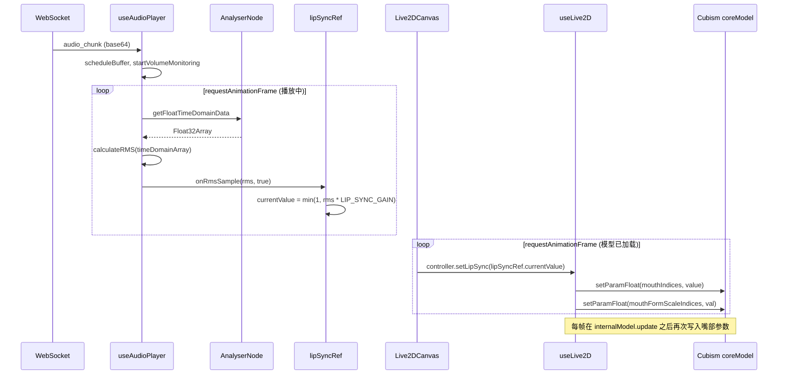

# Live2D 说话时嘴型参数设置逻辑

本文档描述当前项目中「说话时」如何计算并设置 Live2D 嘴部参数，实现口型同步（Lip Sync）。

---

## 1. 整体流程概览

- **音频 → RMS**：播放时由 `useAudioPlayer` 在 rAF 循环里取 Analyser 的时域数据，算 RMS，通过 `lipSyncRef.onRmsSample(rms, isPlaying)` 写入 `lipSyncRef.currentValue`。
- **RMS → 模型**：`Live2DCanvas` 的 rAF 循环每帧调用 `controller.setLipSync(lipSyncRef.currentValue)`；`useLive2D` 在模型内部 `internalModel.update` 之后，对 Cubism `coreModel` 写入嘴部开合与形态参数。

---

## 2. 音频侧：RMS 计算与 currentValue 更新

### 2.1 入口与时机

- **文件**：[src/hooks/useAudioPlayer.ts](src/hooks/useAudioPlayer.ts)
- 收到 `audio_chunk` 后调用 `addAudioChunk` → `scheduleBuffer` 把 PCM 排入播放；若是本轮首次有音频，会 `startVolumeMonitoring()`，启动一个 `requestAnimationFrame` 循环。
- 播放结束（流结束且队列播完）时 `stopVolumeMonitoring()`，并调用 `lipSyncRef.onRmsSample?.(0, false)`，把嘴部目标值置为 0。

### 2.2 音频图与 Analyser

- 创建 `AudioContext` 时顺带创建 `AnalyserNode`：
  - `analyser.fftSize = 256`
  - `analyser.smoothingTimeConstant = 0`（不平滑，便于口型快速跟随音量）
  - `analyser.connect(audioContext.destination)`
- 播放时：`AudioBufferSourceNode` 的 `source.connect(analyser)`，即「播放信号 → Analyser → 扬声器」，口型使用的 RMS 来自同一路播放信号。

### 2.3 每帧在 volume 循环里算 RMS 并写 lipSyncRef

- 在 `updateVolume`（rAF 回调）内：
  - 若 `!isPlayingRef.current`：调用 `lipSyncRef.onRmsSample?.(0, false)`，并继续 rAF，不计算 RMS。
  - 若正在播放：
    - `analyser.getFloatTimeDomainData(timeDomainArray)` 取得当前帧时域数据（Float32，-1～1）。
    - `rms = calculateRMS(timeDomainArray)`（见 [src/utils/audio.ts](src/utils/audio.ts)：`sqrt(sum(x^2)/n)`）。
    - `lipSyncRef.onRmsSample?.(rms, true)`。

### 2.4 lipSyncRef 与 currentValue 计算公式

- **文件**：[src/utils/lipSyncRef.ts](src/utils/lipSyncRef.ts)
- **回调注册**：[src/components/Live2DCanvas/Live2DCanvas.tsx](src/components/Live2DCanvas/Live2DCanvas.tsx) 在 `useEffect` 里设置 `lipSyncRef.onRmsSample`，组件卸载时置为 `null`。

逻辑：

- `isPlaying === false`：`lipSyncRef.currentValue = 0`（闭嘴）。
- `isPlaying === true`：`lipSyncRef.currentValue = Math.min(1, rms * LIP_SYNC_GAIN)`。
- `LIP_SYNC_GAIN = 1.4`（与参考实现 live2d_module.py 中 `lipSyncN = 1.4` 一致）。

即：**嘴部开合目标值 = clamp(rms × 1.4, 0, 1)**，不设下限，静音时可为 0。

---

## 3. 模型侧：每帧把 currentValue 写入 Live2D

### 3.1 谁在调 setLipSync

- **文件**：[src/components/Live2DCanvas/Live2DCanvas.tsx](src/components/Live2DCanvas/Live2DCanvas.tsx)
- 在 `isLoaded && controller` 成立后启动一个 rAF 循环，每帧执行：
  - `controller.setLipSync(lipSyncRef.currentValue)`
- 即：**不依赖播放状态**，只要模型加载完成就每帧用当前 `currentValue` 去设嘴型；播放时 `currentValue` 由 RMS 更新，停止时由上面置 0。

### 3.2 setLipSync 做了什么（对外 API）

- **文件**：[src/hooks/useLive2D.ts](src/hooks/useLive2D.ts)，`setLipSync(value: number)`。
- 仅在有 `model.internalModel.coreModel` 时执行。
- 对 **Cubism 4**：用 `getParameterIndex` / `setParameterValueByIndex` 设 `PARAM_MOUTH_OPEN_Y`（或同义 id），找到一个即停。
- 对 **Cubism 2.1**：用 `getParamIndex` / `setParamFloat` 设 `PARAM_MOUTH_OPEN_Y`、`ParamMouthOpenY`、`Mouth_Open` 中第一个存在的参数为 `value`。
- 这里只负责「嘴部开合量」；嘴型形态（FORM_01/FORM_Y/SCALE）在下面的 internalModel 补丁里统一写。

### 3.3 为何每帧还要在 internalModel.update 里再写一遍嘴部参数

- 模型内部每帧会执行 `internalModel.update(deltaTime, elapsedTime)`：先跑动作/表情等，会改 coreModel 的嘴部参数，若只在外面调 `setLipSync`，下一帧又会被内部逻辑覆盖。
- 因此在 **模型加载时** 对 `internalModel.update` 做了补丁（patch），在 **原始 `update` 执行完之后** 再根据 `lipSyncRef.currentValue` 和固定形态值，重新写入所有嘴部相关参数，保证「说话时以我们算出的嘴型为准」。

---

## 4. internalModel.update 补丁：具体写了哪些嘴部参数

- **文件**：[src/hooks/useLive2D.ts](src/hooks/useLive2D.ts)，在 `initialize` 里、模型加载完成后执行。

### 4.1 参数列表与取值

补丁内维护两类索引（Cubism 2.1 下用 `getParamIndex` 解析，Cubism 4 可类推）：

| 类别 | 参数 ID | 取值 | 含义 |
|------|---------|------|------|
| 嘴部开合 | `PARAM_MOUTH_OPEN_Y`、`ParamMouthOpenY`、`Mouth_Open` | `lipSyncRef.currentValue`（0～1） | 由 RMS 驱动，开合幅度 |
| 嘴部形态 | `PARAM_MOUTH_FORM_01` | 当前实现为 **0.5**（代码中三元式最后一支） | 嘴型：0 中性，0.5 笑容；若希望说话时中性可改为 **0** |
| 嘴部形态 | `PARAM_MOUTH_FORM_Y` | 0 | 嘴型 Y 向 |
| 嘴部形态 | `PARAM_MOUTH_SCALE` | 1 | 嘴部缩放 |

- 开合类：对所有在模型中存在的上述 id，每帧设为 **同一值** `value = lipSyncRef.currentValue`。
- 形态/缩放类：在初始化时根据 `mouthFormScaleIds` 和上面的规则算出 `(idx, val)` 列表，每帧对这些 index 执行 `coreModel.setParamFloat(idx, val)`。

### 4.2 执行顺序与注意点

- 顺序：`originalUpdate(deltaTime, elapsedTime)` → 再对 `mouthIndices` 写开合值 → 再对 `mouthFormScaleIndices` 写形态/缩放。
- **不再在补丁内调用 `coreModel.loadParam()`**：在 Cubism 2.1 中二次调用可能用「保存过的参数」覆盖当前 coreModel，导致我们刚写的嘴部参数被还原，因此补丁只做 `setParamFloat`，不调 `loadParam()`。

---

## 5. 数据流小结

| 阶段 | 位置 | 输入 | 输出 |
|------|------|------|------|
| 音频 → RMS | useAudioPlayer + audio.ts | 播放中的 PCM（Float32 时域） | `rms`，每 rAF 一次 |
| RMS → currentValue | Live2DCanvas 注册的 onRmsSample | `(rms, isPlaying)` | `lipSyncRef.currentValue = isPlaying ? min(1, rms*1.4) : 0` |
| currentValue → 模型 | Live2DCanvas rAF + useLive2D | `lipSyncRef.currentValue` | 每帧 `setLipSync(value)` + 补丁内对 coreModel 写嘴部开合与形态 |

整体效果：**说话时嘴部开合由当前播放音频的 RMS×1.4 驱动，嘴型由 FORM_01/FORM_Y/SCALE 固定为上述值（当前 FORM_01=0.5 为笑容；若要中性说话可改为 0）**。

---

## 6. 相关文件索引

- [src/utils/lipSyncRef.ts](src/utils/lipSyncRef.ts) — 增益常量、`currentValue`、`onRmsSample` 回调
- [src/utils/audio.ts](src/utils/audio.ts) — `calculateRMS`
- [src/hooks/useAudioPlayer.ts](src/hooks/useAudioPlayer.ts) — 播放、Analyser、volume 循环、调用 `onRmsSample`
- [src/components/Live2DCanvas/Live2DCanvas.tsx](src/components/Live2DCanvas/Live2DCanvas.tsx) — 注册 onRmsSample、每帧 `setLipSync`
- [src/hooks/useLive2D.ts](src/hooks/useLive2D.ts) — `setLipSync`、`internalModel.update` 补丁与嘴部参数列表
